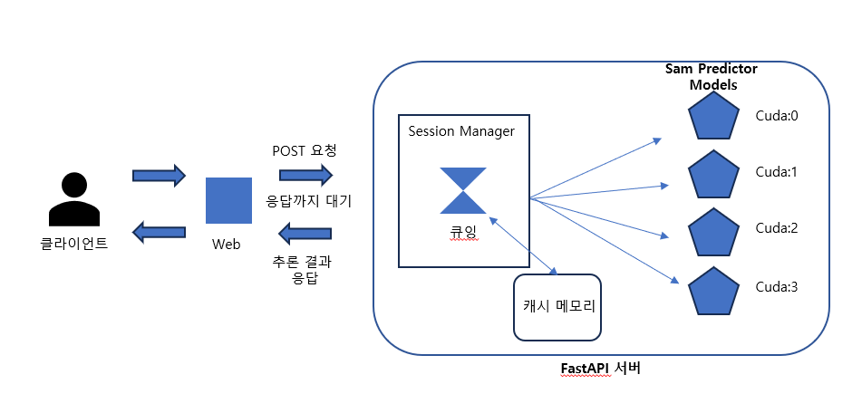
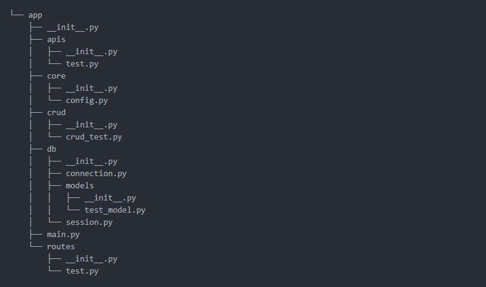

# Usecase
- 구상중인 레이블링 툴의 워크플로에서 추론 결과가 나올 때가지 다음 단계로 진행이 되지 않게 동기적으로 동작.
- 레이블링 툴에서 `sam` 모델 사용 시 워크플로가 추론 결과에 의존함.


# Architecture



- session manager에서 각 요청에 대해 알맞게 gpu에 배분 및 관리 -> 현재는 `cuda:num` 디바이스 하나에만 모델을 할당하였음. (device는 총 4개)
- 클라이언트로부터 들어온 모든 requests를 Session Manager 를 통해 큐잉
  - 큐: session id
- session id 순으로 캐시 테이블에서 데이터를 불러오고 저장
  - cache tabel
    - pk: session id

```
 # sessions = {'session_id': session,
 #              ...
 #              'session_id': session,}  
  
  session = {
            "image": GLOBAL_IMAGE,
            "mask_input": None,
            "segmented_mask": [],
            "interactive_mask": [],
            "zip_buffer": None,
            "global_mask": None,
            "features": None
        }
```
- 코드 리팩토링
  - example
  


# Tools

From top to bottom
- Clear image
- Drawer
- SAM point-segmenter (Need backend)
- SAM rect-segmenter (Need backend)
- SAM Seg-Everything (Need backend)
- Undo
- Eraser

# Run Locally

If don't need SAM for segmentation, just open segDrawer.html and use tools except SAM segmenter.

model 다운로드 링크
- Download models as mentioned in [segment-anything](https://github.com/facebookresearch/segment-anything).
For example
```
wget https://dl.fbaipublicfiles.com/segment_anything/sam_vit_h_4b8939.pth
wget https://dl.fbaipublicfiles.com/segment_anything/sam_vit_l_0b3195.pth
wget https://dl.fbaipublicfiles.com/segment_anything/sam_vit_b_01ec64.pth
```
- Launch backend
```
python app.py
```
- Go to Browser
```
http://127.0.0.1:8000
```

For configuring CPU/GPU and model, just change the code in server.py
```
sam_checkpoint = "sam_vit_l_0b3195.pth" # "sam_vit_l_0b3195.pth" or "sam_vit_h_4b8939.pth"
model_type = "vit_l" # "vit_l" or "vit_h"
device = "cuda" # "cuda" if torch.cuda.is_available() else "cpu"
